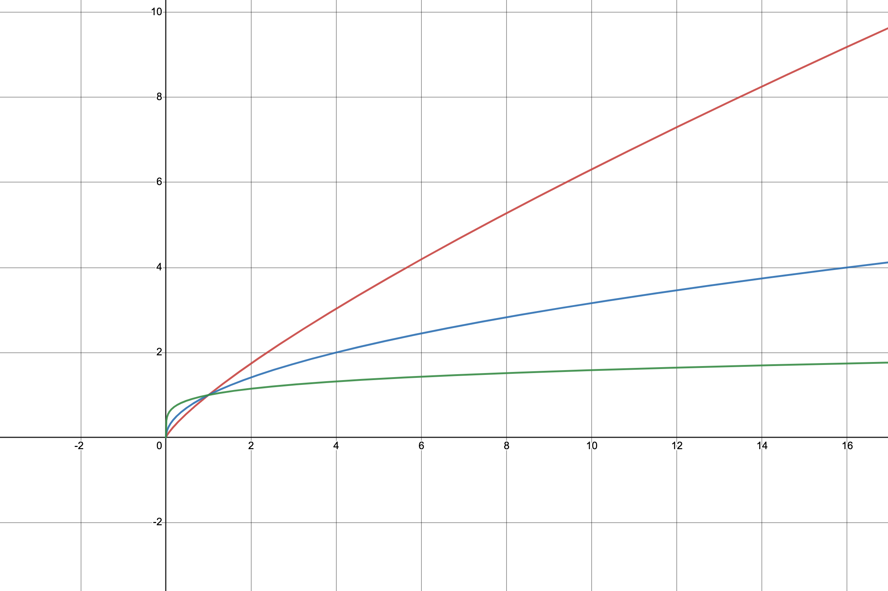

# PIC | System Task

Within Pido, PIC tokens can be earned by completing specific tasks. Here is a detailed explanation of the task output mechanism:

## **Initial Rewards**

* **First-time Login Gift**: New users will receive $$A$$ PIC tokens as a welcome gift upon their first entry into the system.
* **One-time Reward**: Note that this initial reward is limited to a one-time collection per user to ensure fairness.

By designing initial rewards, users are ensured to start accumulating PIC tokens from their very first day on the platform, which will enhance the users' sense of belonging.

## **Check-in Tasks**

* **Daily Check-in**: Users can earn PIC token rewards through daily check-in actions.
* **Incremental Rewards**: The check-in rewards feature a growth mechanism, where the reward amount accumulates with the number of consecutive check-in days.
* **Cycle Period**: The reward growth cycle operates on a seven-day loop, encouraging users to participate consistently.
* **Reward Details**

| Day   | Amount of PIC |
| ----- | ------------- |
| Day 1 | $$B_1$$       |
| Day 2 | $$B_2$$       |
| Day 3 | $$B_3$$       |
| Day 4 | $$B_4$$       |
| Day 5 | $$B_5$$       |
| Day 6 | $$B_6$$       |
| Day 7 | $$B_7$$       |

The specific numerical value of daily check-in rewards will be provided subsequently.

Check-in task output mechanisms are designed to motivate users' daily participation and activity, providing ongoing incentives for long-term active users of the platform.

## Daily Tasks&#x20;

On Pido, active participation by users is rewarded with PIC tokens. Here are the specific ways users can earn PIC by completing daily tasks, as well as how to calculate the maximum number of PIC that can be obtained each day.

### **Task Reward Details**

**Task Rewards Upper Limit**

* Users can earn PIC tokens each day by completing daily tasks, with a daily maximum of $$C_0=k_0\ln (N+1)+b_0$$ PIC tokens.

**Daily Task Rewards List**

1. **Login Rewards**:
   * Logging into Pido every day will earn users $$C_1$$ PIC tokens.
2. **First NFT Like Rewards**:
   * Users will receive $$C_2$$ PIC tokens the first time they like an NFT every day.
3. **First NFT Purchase Rewards**:
   * Users will receive $$C_3$$ PIC tokens for their first purchase of any NFT every day.
4. **First NFT Bid Rewards**:
   * Users will receive $$C_4$$ PIC tokens for their first participation in an NFT bid every day.
5. **NFT Voting Rewards**:
   * Users will earn PIC according to the formula $$C_5n^{r_1}$$ for each vote they cast for an NFT.
   * $$n$$ is the number of votes.
   * $$r_1$$ is a constant between 0 and 1.
   * We will set $$r_1=0.5$$ initially and gradually adjust the value based on feedback from the system.

<figure><figcaption>
Different trend when  r_1=0.2(Green) r_1=0.5(Blue) r_1=0.8(Red)
</figcaption></figure>

6. **Achievement Completion Rewards**
   * Completing specific achievements will grant users a one-time reward of $$C_6$$ PIC tokens.
   * The specific list of achievements will be provided subsequently.

### **Maximum Daily Reward Calculation**

There is an upper limit on the total amount of PIC a user can earn in a single day. This upper limit is based on the sum of PIC earned from daily tasks and special event rewards. The specific calculation for the upper limit is as follows:

The maximum number of PIC tokens a user can earn daily is

$$
\min \{ C_0, C_1 + C_2 + C_3 + C_4 + C_5n^{r_1} + C_6 \}
$$

This limit ensures that the daily distribution of PIC on the platform is both incentivizing yet controlled to prevent excessive inflation. In this way, Pido aims to encourage user participation while maintaining the stability of the token economy.
