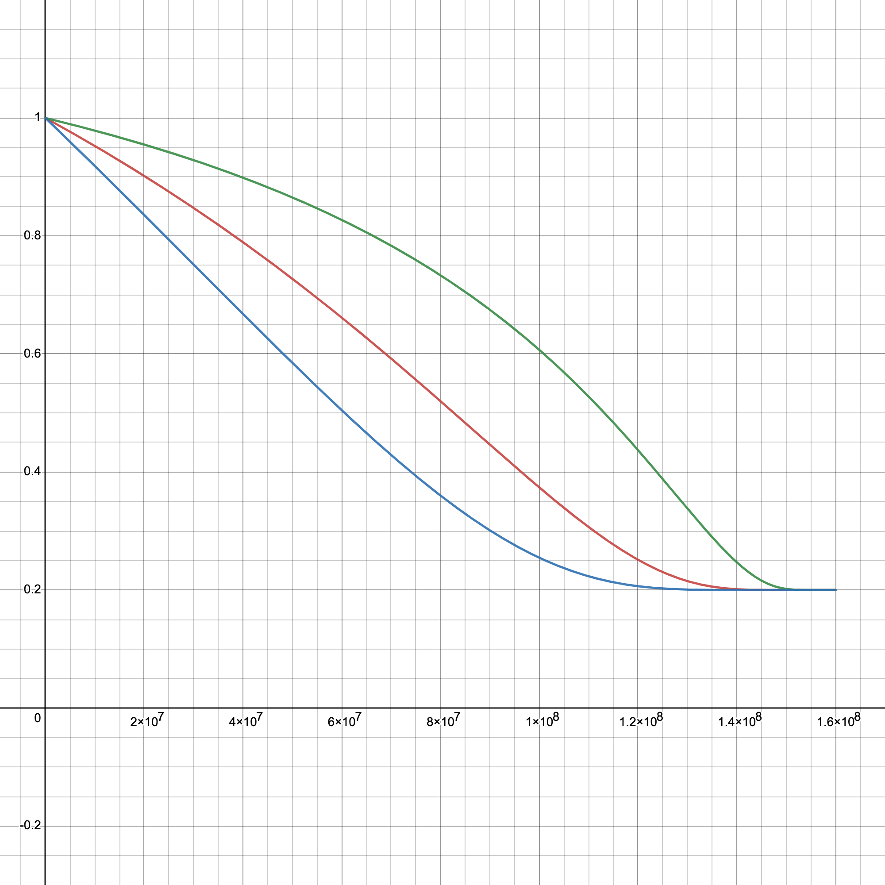

# PIT | Bid to Earn

## **Mechanism Introduction**

The auction element of the Bid to Earn model introduces a competitive environment where participants can earn tokens as a reward for bidding on NFTs. Here is a detailed explanation of this process:

1. **Reward Distribution Mechanism**: In the limited edition NFT auction, both participating consumers and designers/artists have the opportunity to receive PIT tokens as a reward.
2. **NFT Grades and Settlement Unit**: Limited edition NFTs up for auction are categorized into grades such as S, A, B, etc., with the settlement units being fiat currencies, including USD (US Dollars) and RMB (Renminbi).
3. **NFT Upload Fee**: Designers/Artists are required to pay $$E_A$$ PIT tokens before uploading their NFT creations, where $$E_A$$ is set by the designers/artists but must not be less than the prescribed minimum value. This minimum is influenced by factors such as the auction's floor price, duration, and the number of items.&#x20;
4. **Sales Method**: NFTs are sold in an auction format, and upon the auction's conclusion, PIT rewards will be distributed to designers/artists and consumers according to certain rules.
5. **Starting Bid Price**: The starting bid price for NFTs is set at $$p_0$$.
6. **Consumer Bidding**:
   * Each consumer's bid is $$p_i$$.
   * The price difference from the starting bid is defined as $$\Delta p_i = p_i - p_0$$.
   * The bidding time for each consumer is noted as $$t_i$$.
7. **Bidding Period**: The bidding period for each NFT is set at $$T$$.
8.  **Reward Pool Calculation Formula**:

    The total accumulated PIT in the reward pool is calculated using the following formula:

    $$
    F = k_1\bigg[\lambda +(1-\lambda )a_2^{-\frac{x}{y}}\bigg]\left(\sum \Delta p_i\sqrt{\frac{E_A}{\sum \Delta p_i}}\right)^2
    $$

    where $$k_1$$ and $$a_2 >1$$ are parameters, and $$y$$ represents the remaining PIT quantity in the NFT bidding pool, with an initial stage of $$x+y=160,000,000$$.
9. **User Staking**
   * The total amount of PIT held by a user is $$N$$ tokens.
   * The total amount of PIT staked by a user is $$N'$$ tokens.
10. **Growth Coefficient**

    The growth coefficient $$v(N,N')$$ for obtaining PIT is calculated using the formula:

    $$
    v(N,N')=\begin{cases}{N'}^r & N \leq c\\{\big(\frac{cN'}{N}\big)}^r & N > c\end{cases}
    $$

    where $$c,r$$ are constants satisfying $$c >1,0<r<1$$.
11. **Reward Allocation**

    * The amount of PIT rewards for designers/artists is $$15\%F\max\{v_0,v(N_d,N_d')\}$$, where $$N_d'$$ is the amount of PIT staked by the designer/artist.
    * The total PIT rewards for consumers is $$80\%F\max\{v_0,v(N_{c_i},N_{c_i}')\}$$, where $$N_{c_i}'$$ is the amount of PIT staked by each consumer.
    * The reward amount for each consumer is calculated using the formula:

    $$
    80\%F\frac{[\Delta p_i(T - t_i)]^{r_3}}{\sum [\Delta p_i(T - t_i)]^{r_3}}\max\{v_0,v(N_{c_i}, N_{c_i}')\}
    $$

    where $$r_3 > 1, v_0<1$$ is a parameter.
12. **Rewards for Successful Bidder**: The consumer who successfully bids for the limited edition will receive double the PIT rewards, which is:

    $$
    160\%F\frac{[\Delta p_i(T - t_i)]^{r_3}}{\sum [\Delta p_i(T - t_i)]^{r_3}}\max\{v_0,v(N_{c_i}, N_{c_i}')\}
    $$
13. **Transaction Fee**: After the auction concludes, a transaction fee of $$5\%F$$ PIT tokens will be deducted from the reward pool.

## **NFT Upload Fee Algorithm**

1. **Base Variables**
   * The starting bid price for NFTs is set at $$p_0$$.
   * The bidding period for each NFT is set at $$T$$.
   * The number of auction items is set at $$n$$.
2. **Non-Linear Influence Functions**
   * Starting Bid Price Influence: $$W_{p} = c_{p}  \ln(p_0 + 1)$$.
   * Bidding Period Influence: $$W_{t} = c_{t} (e^{\frac{T}{T_0}} - 1)$$, where $$T_0$$ is a time normalization constant.
   * Number of Items Influence: $$W_{n} = c_{n} n$$.
3.  **Integrate Base Upload Fee and Influences:** Combine the base upload fee $$E_{A0}$$ with the non-linear influences calculated above to determine a upload fee:

    $$
    E_A'=E_{A0}+W_p+W_t+W_n
    $$
4.  **Adjust for Market Conditions**: Optionally, include a dynamic adjustment factor $$\delta$$ that accounts for real-time market conditions and ensures platform competitiveness, we set $$\delta=0$$ initially.

    $$
    E_A=(1+\delta)E_A'
    $$
5. **Final Confirmation**:
   * If the upload fee is greater than or equal to $$E_A$$, confirm the fee.
   * If the upload fee is less than $$E_A$$, request an adjustment to at least meet $$E_A$$.

## Explanation and analysis

The core of the "Bid to Earn" mechanism is to obtain PIT tokens as rewards through auction activities. Now we delve deeper into each component of "Bid to Earn" and how they interact with each other.

### Key Components

1. #### **Reward Mechanism for Artists and Consumers**

The system rewards both the designers/artists who create and upload the NFTs and the consumers who participate in the auction. The PIT rewards act as an incentive for active participation in the marketplace.

2. **NFT Grades and Settlement Currency**

NFTs are categorized into different grades, such as S, A, and B, which represent varying levels of rarity or value. Transactions are settled in fiat currencies like USD or RMB, which are more stable compared to cryptocurrencies and can attract a broader range of participants.

3. #### **Uploading Fees for Designers/Artists**

Designers/Artists must pay a certain amount of PIT tokens to upload their NFT creations to the platform. The required amount, denoted as $$E_A$$, is determined by the artist but must meet a minimum threshold. This fee structure may be in place to prevent spam and ensure that only serious artists list their work.

4. #### **Auction Parameters**

NFTs are sold through an auction process where the highest bidder wins. The auction parameters include the starting bid $$p_0$$, individual consumer bids $$p_i$$, and the time $$t_i$$ at which each bid is placed. These parameters are crucial for determining the final reward distributions.

5. **PIT Held by Users (**$$N$$**) and PIT Staked (**$$N'$$**)**

These two variables affect the growth coefficient in the exchange process. The more PIT a user holds and stakes, the greater the discounts they may enjoy when exchanging for additional PIT. This encourages users to not only purchase and hold PIT but also to participate in staking, supporting network security and governance.

6. **Growth Coefficient (**$$v(N,N')$$**)**

The piecewise function in this formula ensures that when the PIT held by users is less than a certain threshold (determined by $$c$$), they can directly influence the number of PIT they obtain through the amount of PIT staked. When a user's holdings exceed this threshold, the exchange efficiency is reduced as the growth coefficient is inversely proportional to the holdings $$N$$.

<figure><figcaption>
Different trend when N'=20, c=30(Red) N'=40, c=10(Blue) N'=10, c=100(Green)
</figcaption></figure>

7. **Reward Pool Calculation Formula**

* The part $$a_2^{-\frac{x}{y}}$$ in the formula indicates that as the remaining amount of PIT decreases, i.e., $$y$$ becomes smaller, the rewards will fall. As $$x$$ grows or $$y$$ shrinks, this will serve as a regulatory mechanism to prevent overinflation of the pool's value and ensure the scarcity and value of the PIT tokens.
* The parameter $$\lambda=0.2$$ ensures that even if the remaining amount of the token pool $$y$$ is very small, the output speed will not drop to 0, which prevents the production from coming to a complete halt.
* The term $$1-\lambda$$ ensures that at the beginning, when $$x=0$$, the output factor is 1, which means that the token's production speed is at its maximum initially.

<figure><figcaption>
Different trend when a_2=1.5(Green) a_2=2.5(Red) a_2=5(Blue)
</figcaption></figure>

*   The core part of the formula is:

    $$
    \left(\sum \Delta p_i\sqrt{\frac{E_A}{\sum \Delta p_i}}\right)^2
    $$

    This part calculates a value by multiplying the total sum of bid increments by a weight adjusted according to NFT upload fee ($$E_A​$$), and then squaring this value. This means that the auction's activity level (through the increments of bids) is combined with the auction's economic dynamics ($$E_A​$$) to determine the size of the reward pool.
* The formula reflects a complex dynamic that may aim to encourage more auction activity and adjust the size of the reward pool based on the auction's popularity and market dynamics.

8. **Reward Distribution**

The rewards are distributed as follows:

* Designers/Artists receive 15% of the calculated reward pool, adjusted by their staking coefficient.
* Consumers share 80% of the reward pool, with individual rewards based on their bid increments, timing, and staking coefficient.
* The winning bidder gets a doubled reward, providing a significant incentive to compete for the NFT.

### Strategies and Incentives

* **Designer/Artist Incentives:** Designers/Artists are incentivized through rewards for uploading NFTs and a share of the auction proceeds. This encourages high-quality and desirable NFT creation.
* **Consumer Incentives:** Consumers are encouraged to participate through the potential of earning rewards from their bids. The more they participate, the more they stand to gain, which increases platform engagement.
* **Winning Bidder Incentives:** Doubling the reward for the winning bidder creates a strong incentive to not only participate but to compete aggressively, potentially increasing the final bid amounts.

### Long-Term Participation

* **Sustained Participation:** The "Bid to Earn" mechanism encourages users to hold and stake PIT tokens for the long term through the staking mechanism, which helps to reduce market volatility.
* **Sustainability of Rewards:** Adjusting the reward formula and proper parameters ensures the long-term sustainability of the system, preventing the reward pool from being depleted too quickly while maintaining user incentives.
* **Network Effects:** The reward mechanism makes it more likely for users to invite others to join and participate in the bidding, which helps to enhance network effects. As the user base grows, the value of the platform and the demand for NFTs will also increase, further driving up the value of PIT tokens.
* **Community Participation:** Community building is another key point of the "Bid to Earn" mechanism. Incentivizing users to contribute high-quality content and engage actively can create a more vibrant and engaged community environment.
* **Feedback Loop:** The reward distribution and staking mechanisms can create a positive feedback loop where rewards obtained by users can be used for further bidding or staking, thereby increasing the users' activity on the platform and their investment in it.

