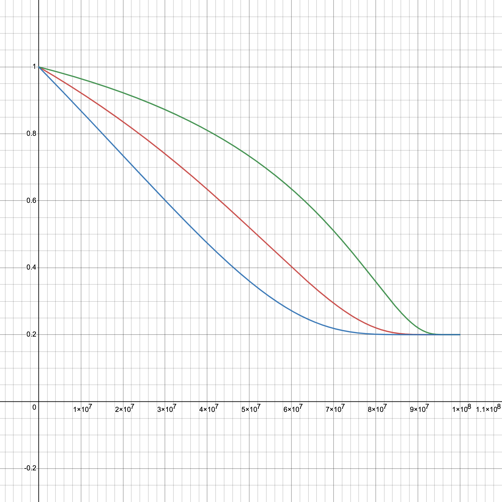

# PIT | Burn to Earn

## **Mechanism Introduction**

In Pido's "Burn to Earn" mechanism, users can exchange their governance token PIT by burning  the utility tokens PIC they hold. This process not only reduces the total supply of PIC, but also provides a pathway for users to obtain PIT. Here is a detailed explanation of this process:

1. **Exchange Mechanism**
   * PICs held by users can be burned to exchange for PITs.
   * The base exchange rate of PIC to PIT is $$u$$, meaning users need to burn $$u$$ PICs to exchange for 1 PIT.
2. **User Holdings**
   * The total amount of PIT currently held by the user is $$N$$.
   * The total amount of PIT currently staked by the user is $$N'$$.
   * The user wishes to obtain an additional $$D$$ PITs by burning PICs.
3.  **Growth Coefficient**

    * $$v(N,N')$$ is a growth coefficient based on the amount of PIT held and staked by the user.
    * When $$N \leq c$$, the coefficient equals $${N'}^r$$.
    * When $$N > c$$, the coefficient equals $${\big(\frac{cN'}{N}\big)}^r$$.
    * Here is the formula:

    $$
    v(N,N')=\begin{cases}{N'}^r & N \leq c\\{\big(\frac{cN'}{N}\big)}^r & N > c\end{cases}
    $$
4.  **Exchange Cost**

    * The constant $$c$$ satisfies $$c>1$$, $$r$$ satisfies $$0<r<1$$.
    * The number of PICs needed to exchange for $$D$$ PITs in a single day is determined by the following formula:

    $$
    \frac{u}{\lambda +(1-\lambda)a_1^{-\frac{x}{y}}}\cdot\frac{D^{r_2}}{\max \{v_0,v(N,N')\}}
    $$

    * Where $$a_1$$ and $$r_2$$ are constants greater than 1, $$v_0$$ is constant less than 1, $$\lambda=0.2$$ initially.
    * $$y$$ represents the remaining amount of PIT in the PIC exchange pool with an initial stage of $$x+y=80,000,000$$.
    * $$D$$ is reset to 0 at the start of each day.
5. **Transaction Fee**
   * A 5% fee in PIT is deducted with each exchange, meaning users will actually receive less PIT than the amount they exchanged with their PICs.

## Explanation and analysis

The "Burn to Earn" process aims to balance the supply of PIC and incentivizing users to hold and stake PIT. Now we delve deeper into each component of "Burn to Earn" and how they interact with each other.

### Key Components

1. **PIT Held by Users (**$$N$$**) and PIT Staked (**$$N'$$**)**

These two variables affect the growth coefficient in the exchange process. The more PIT a user holds and stakes, the greater the discounts they enjoy when exchanging for additional PIT. This encourages users to not only purchase and hold PIT but also to participate in staking, supporting network security and governance.

2. **Growth Coefficient (**$$v(N,N')$$**)**

The piecewise function in this formula ensures that when the PIT held by users is less than a certain threshold (determined by $$c$$), they can directly influence the number of PIT they obtain through the amount of PIT staked. When a user's holdings exceed this threshold, the exchange efficiency is reduced as the growth coefficient is inversely proportional to the holdings $$N$$.

<figure><figcaption>
Different trend when N'=20, c=30(Red) N'=40, c=10(Blue) N'=10, c=100(Green)
</figcaption></figure>

3. **PIC Exchange Cost Formula**

* The part $$a_1^{-\frac{x}{y}}$$ in the formula indicates that as the remaining amount of PIT decreases, i.e., $$y$$ becomes smaller, the exchange cost of PIC will rise. As $$x$$ grows or $$y$$ shrinks, this will serve as a regulatory mechanism to prevent overinflation of the pool's value and ensure the scarcity and value of the PIT tokens. This means that users who exchange PIT earlier will enjoy lower exchange costs.
* The parameter $$\lambda=0.2$$ ensures that even if the remaining amount of the token pool $$y$$ is very small, the output speed will not drop to 0, which prevents the production from coming to a complete halt.
* The term $$1-\lambda$$ ensures that at the beginning, when $$x=0$$, the output factor is 1, which means that the token's production speed is at its maximum initially.

<figure><figcaption>
Different trend when a_1=1.5(Green) a_1=2.5(Red) a_1=5(Blue)
</figcaption></figure>

* The part $$\frac{D^{r_2}}{\max \{v_0,v(N,N')\}}$$ shows that the more PIT a user wants to exchange and the greater their holdings $$N$$, the more PIC they need to pay. However, this is also offset by their staked amount $$N'$$ and the growth coefficient $$v(N,N')$$.
* As more PITs are exchanged throughout the day, $$D$$ increases. This, in turn, increases the number of PICs needed for each subsequent PIT exchange as the day progresses, reflecting the marginal cost increase for exchanging more PITs. The daily reset of $$D$$ ensures that each day offers a fresh start for users to exchange PIT at a lower marginal cost, which can incentivize users to participate in the exchange daily.

### Strategies and Incentives

Through such mechanisms, Pido aims to achieve the following objectives:

* **Reducing the Circulating Supply of PIC**: Destroying PIC in exchange for PIT reduces the total supply of PIC, which will increase its scarcity and potential value from a supply and demand perspective.
* **Promoting the Holding and Staking of PIT**: By providing exchange incentives, users are encouraged not just to purchase PIT, but to hold and stake it long-term, thereby supporting the platform's governance.
* **Dynamically Adjusting Exchange Costs**: Increasing the cost of exchanging as the PIT exchange pool diminishes helps to prevent excessive exchanges when the supply of PIT is reduced, thus protecting the value of PIT.
* **Ensuring Fairness in Exchange Opportunities**: Early users benefit from lower exchange costs, but as time passes and the supply of PIT decreases, the increase in exchange costs also provides fairness for later users.

### Long-Term Participation

This unique mechanism design has several long-term incentives and participation objectives:

* **Continuously Incentivizing Users to Stake**: Staking PIT generally contributes to governance mechanisms. By making the number of staked PIT a key factor in obtaining additional PIT, users are encouraged to lock up their tokens, thus supporting the network.
* **Dynamic Market Response**: The dynamic adjustment of the exchange rate, as the values of $$x$$ and $$y$$ change, reflects the real-time supply and demand status of the market. This responsiveness can help stabilize the long-term value of the token.
* **Preventing Market Manipulation**: By setting a transaction fee and a complex exchange cost formula, the mechanism may prevent large holders from manipulating the market by exchanging large amounts of PIT.
* **Community Incentives**: To maximize their PIT exchange, users may collaborate with each other, forming communities to discuss the best strategies and share insights.
* **Increasing User Stickiness**: Requiring users to stake in order to get better exchange rates can increase user participation and loyalty to the platform.

Overall, the "Burn to Earn" mechanism is a method that incentivizes user participation in network governance through the burning of tokens and staking participation. This approach aims to balance token supply, increase network participation, and protect the network from manipulation by setting transaction fees and dynamic exchange costs.&#x20;

\
