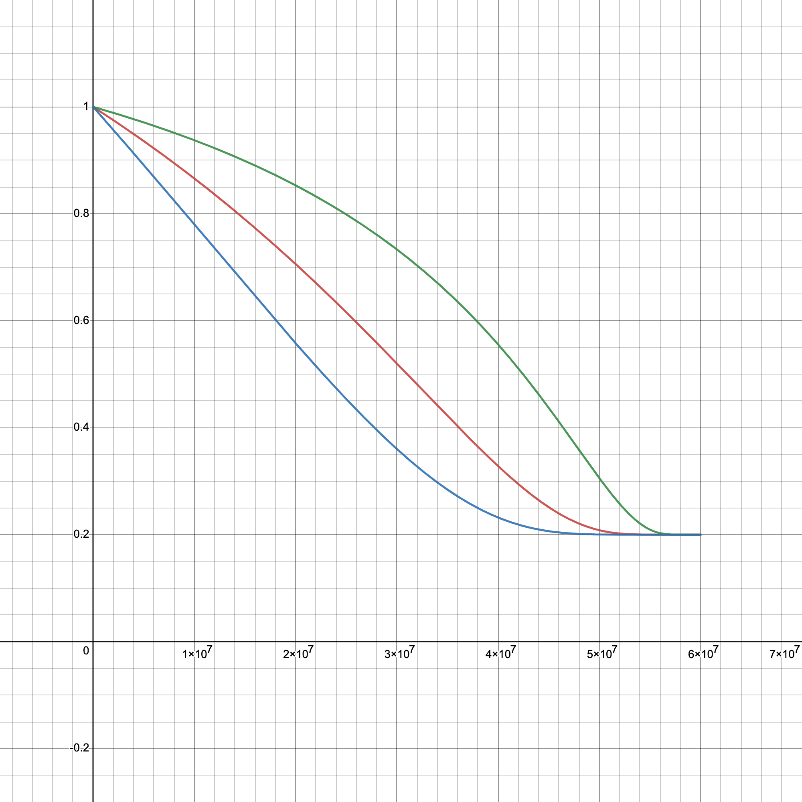

# PIT | Curate to Earn

## **Mechanism Introduction**

"Curate to Earn" is a system designed to reward users, referred to as curators (or buyers), who showcase and promote designs/artworks on their personalized pages. The mechanism is structured to incentivize curators to display both limited and unlimited edition designs/artworks, with the potential to earn rewards through their curatorial activities. Here is a detailed explanation of this process:

1. **Curator Role**: Users take on the role of curators by selecting and displaying designs/artworks on their homepage. When consumers purchase designs/artworks or participate in auctions through a curator's page, the curator earns PIT rewards and fiat money share.
2. **Design/Artwork Listings**: Curators can feature both limited and unlimited edition designs/artworks on their homepage. While curators can promote designers/artists' works, they do not own the rights to the designs/artwork or the associated NFTs. Sales of the curated designs/artworks are settled in fiat currency (USD or RMB).
3. **Monthly Fees**
   * The starting bid or direct sale price of curated designs/artworks is denoted by $$P$$.
   * Curators pay a monthly fee for the designs/artworks they list, calculated for auction items as $$k_{9}I_AP^{r_{10}}$$ and for crowdfunding items as $$k_{9}I_CP^{r_{10}}$$, where $$I_A$$ and $$I_C$$ are Auction and Crowdfunding Pido indices, respectively.&#x20;
   * $$k_{9}$$ and $$0<r_{10}<1$$ are constants.
   * The total monthly fee a curator must pay is $$k_{9}\sum \big (I_{Ai}P_i^{r_{10}}+I_{Cj}P_j^{r_{10}}\big)$$ in PIC tokens.
   * The PIC tokens paid by curators for listing designs/artworks are transferred to the corresponding designers/artists.
4. **Commission**
   * **Fiat money share:** Curators earn a 2% commission $$2\%P$$ on every transaction or bid successfully completed through their page; no commission is earned on unsuccessful bids.
   * **PIT Rewards**: Besides the fiat commission, curators also receive PIT rewards for successful transactions or bids made through their curation page.
5. **Total and Staked PIT**: Curators have $$N$$ total PIT tokens, with $$N'$$ being the staked amount.
6.  **Growth Coefficient for PIT Rewards**: The PIT growth coefficient $$v(N,N')$$ is:

    $$
    v(N,N')=\begin{cases}{N'}^r & N \leq c\\{\big(\frac{cN'}{N}\big)}^r & N > c\end{cases}
    $$

    where $$c>1,0<r<1$$.
7. **PIT Rewards from Sales**
   *   For each transaction completed through the curation page, curators receive a PIT reward calculated by

       $$
       k_{10}\bigg[\lambda+(1-\lambda)a_9^{-\frac{x}{y}}\bigg]P^{r_{11}}\max\{v_0,v(N,N')\}
       $$

       where $$k_{10}>1, a_9>1, 0<r_{11}<1,v_0<1$$ are constants, and $$y$$ represents the remaining PIT in the pool, with an initial stage of $$x+y=60,000,000$$.&#x20;
   *   Curators receive 95% of the generated PIT as a reward, i.e.,&#x20;

       $$
       95\%k_{10}\bigg[\lambda+(1-\lambda)a_9^{-\frac{x}{y}}\bigg]P^{r_{11}}\max\{v_0,v(N,N')\}
       $$

       with the remaining 5% serving as a system transaction fee.
8. **PIT Rewards from Bids**
   *   If a bid is successful with a final sale price of $$S_s$$, the PIT reward is

       $$
       k_{11}\bigg[\lambda+(1-\lambda)a_{10}^{-\frac{x}{y}}\bigg]{(S_s-P)}^{r_{12}}\max\{v_0,v(N,N')\}
       $$
   *   If a bid is unsuccessful with an offer price of $$S_f$$, the PIT reward is

       $$
       k_{12}\bigg[\lambda+(1-\lambda)a_{11}^{-\frac{x}{y}}\bigg]{(S_f-P)}^{r_{13}}\max\{v_0,v(N,N')\}
       $$
   * For both successful and unsuccessful bids, curators receive 95% of the generated PIT as a reward, and the remaining 5% is deducted as a system fee.
9. **Consumer Incentives**: Consumers do not receive rewards from the curation system, but they can earn PIT rewards for participating in bids or minting NFTs.

This "Curate to Earn" model is designed to create a symbiotic relationship between designers, artists, curators, and the platform, where curators actively promote designs/artworks and facilitate sales, designers/artists gain exposure and income, and the platform benefits from the vibrant activity and transaction fees. The use of both fiat currency and cryptocurrency (PIT and PIC  tokens) integrates traditional and modern elements of the design/art market, potentially attracting a broad audience of design/art enthusiasts and investors.

## Explanation and analysis

The "Curate to Earn" mechanism is a model that incentivizes curators to promote artworks by offering them rewards for their efforts. Here's a more detailed breakdown of the components and processes involved.

### Key Components

1. **Curator Role**: Curators act as promoters or micro-galleries/museums, showcasing designers/artists' works. They are incentivized to drive sales through their pages since they earn rewards for successful transactions. This could encourage curators to be selective and to market the designs/artworks effectively. The ability to list both limited and unlimited editions could cater to different market segments, providing a range of scarcity and price points.
2. **Fiat Settlement**: The use of fiat currency for settlements aims to bridge the gap between traditional art sales and the emerging digital economy, making it more accessible to those unfamiliar with cryptocurrencies.
3. **Monthly Fees**: Curators must pay a fee to list designs/artworks. This recurring cost could ensure only serious curators participate, which will elevate the quality of curation and maintain a level of commitment.
4. **Fee Formula**: The formula indicates a dynamic pricing model where the fee depends on the artwork's starting price and some indices. This could align curator interests with the quality and marketability of their selections. Check the details of Pido indices in


[pido-index](../../../more-functions/pido-index/)


5. **Total Monthly Fees**: The aggregation of fees for all listed items could become quite significant, making it essential for curators to generate sales to cover these costs.
6. **Rewards**: A 2% fiat commission on transactions is relatively standard in sales and auctions. This provides a clear, direct incentive for curators to generate sales. Rewards in the form of PIT tokens for transactions introduce a dual-reward system, offering both immediate fiat commissions and potentially appreciating digital assets.
7. **PIT Held by Users (**$$N$$**) and PIT Staked (**$$N'$$**):** These two variables affect the growth coefficient in the exchange process. The more PIT a user holds and stakes, the greater the discounts they may enjoy when exchanging for additional PIT. This encourages users to not only purchase and hold PIT but also to participate in staking, supporting network security and governance.
8.  **Growth Coefficient (**$$v(N,N')$$**):** The piecewise function in this formula ensures that when the PIT held by users is less than a certain threshold (determined by $$c$$), they can directly influence the number of PIT they obtain through the amount of PIT staked. When a user's holdings exceed this threshold, the exchange efficiency is reduced as the growth coefficient is inversely proportional to the holdings $$N$$.

    <figure><figcaption>
Different trend when N'=20, c=30(Red) N'=40, c=10(Blue) N'=10, c=100(Green)
</figcaption></figure>
9.  **PIT Rewards from Sales**

    * The reward mechanism is designed to encourage curators to promote and sell higher-priced designs/artworks (since $$P$$ is in the formula), but with diminishing returns to prevent excessively large rewards for extremely high-priced sales.&#x20;
    * The part $$a_9^{-\frac{x}{y}}$$ and $$a_{10}^{-\frac{x}{y}}$$in the formula indicate that as the remaining amount of PIT decreases, i.e., $$y$$ becomes smaller, the rewards will fall. As $$x$$ grows or $$y$$ shrinks, this will serve as a regulatory mechanism to prevent overinflation of the pool's value and ensure the scarcity and value of the PIT tokens.
    * The parameter $$\lambda=0.2$$ ensures that even if the remaining amount of the token pool $$y$$ is very small, the output speed will not drop to 0, which prevents the production from coming to a complete halt.
    * The term $$1-\lambda$$ ensures that at the beginning, when $$x=0$$, the output factor is 1, which means that the token's production speed is at its maximum initially.

    <figure><figcaption>
Different trend when a_9,a_{10}=1.5(Green) a_9,a_{10}=2.5(Red) a_9,a_{10}=5(Blue)
</figcaption></figure>
10. **Reward Distribution**
    * **95%**: This is a very high percentage of the rewards going to the curators, which strongly incentivizes them to sell design/art through their curation pages.
    * **5%**: This remaining portion serves as a system transaction fee, which is used to support the platform's operational costs.
11. **PIT Rewards from Bids**
    * **Successful bids (**$$S_s$$**)**: The reward is based on the final sale price minus the starting price, raised to the power of $$r_{12}$$. This  incentivizes curators to generate competitive bidding that pushes the final sale price above the starting price.
    * **Unsuccessful bids (**$$S_f$$**)**: The reward is still given for unsuccessful bids but based on the offer price minus the starting price, raised to the power of $$r_{13}$$. This encourages curators to attract bids, even if they don't result in a sale.

### Strategy and Incentives

1. **Selective Curation**: Since their income depends on the designs/artworks they promote, curators have a strong incentive to choose and showcase art that they believe has the highest sales potential. This involves understanding market trends, artist reputation, and the tastes of the community.
2. **Active Promotion**: To maximize their earnings, curators are incentivized to actively promote the design/art they curate. This includes leveraging social media, personal networks, and other marketing strategies to attract prospective buyers to their pages.
3. **Price Optimization**: Curators are encouraged to find a balance between the starting price of the designs/artwork and its perceived value. Setting the price too high may deter consumers, while setting it too low may not optimize the rewards possible from the sale.
4. **Auction Engagement**: Curators need to drive competitive bidding in auctions to increase final sale prices. This could involve creating buzz around certain pieces or auction events to encourage more participation.
5. **Community Building**: Through building a strong following or community, curators can have a ready pool of potential buyers to whom they can market new listings.
6. **Diversification**: To mitigate risk, curators should diversify the types of design/art they promote, ensuring they cater to different buyer interests and market segments.
7. **Staking PIT**: Holding and possibly staking PIT tokens could increase their rewards and influence within the platform, depending on the mechanisms in place.

### Long-Term Participation

1. **Reputation Building**: Over time, successful curators can build a reputation for quality curation, which can lead to more traffic and sales through their page, creating a virtuous cycle of increasing rewards.
2. **Compounding Rewards**: The system is designed so that rewards can compound, with successful curators earning more tokens, which can then be staked or reinvested into the platform to increase future earnings.
3. **Exclusive Access**: Curators who demonstrate success and long-term commitment could be granted exclusive access to high-profile listings or special platform privileges.
4. **Community Status**: Being a long-term curator could come with social capital and prestige within the community, which can be an incentive in itself.
5. **Portfolio Growth**: Curators may be able to build a digital portfolio of the design/art they've successfully promoted, which can serve as a testament to their curatorial acumen and attract more designers/artists and buyers.
6. **Skill Development**: As curators engage with the platform over time, they can become more adept at predicting trends and understanding the digital art market, which can translate to better curation choices and increased sales.
