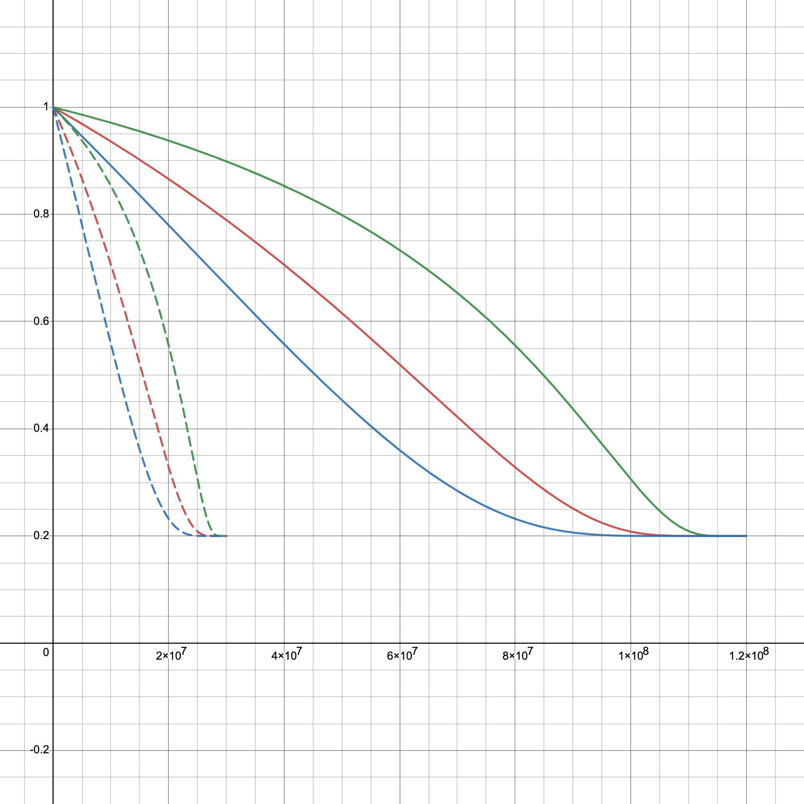

# PIT | Transact to Earn

## **Mechanism Introduction**

In this "Transact to Earn" model, consumers and designers/artists earn PIT tokens as rewards by trading NFTs on the secondary market. The core of the model is to incentivize users to continually participate and increase the platform's liquidity through transaction activities. Here is a detailed explanation of this process:

### Transaction Rewards

1. **Total Supply**: 120,000,000 PIT tokens, which is 12% of the total.
2. **PIT Generation Calculation**
   *   When the transaction price $$Q_f$$ is higher than the initial price $$Q_0$$, each successful transaction generates $$K_1$$ PIT tokens. The formula is as

       $$
       K_1=k_4\bigg[\lambda+(1-\lambda)a_4^{-\frac{x}{y}}\bigg](Q_f-Q_0)^{r_5}
       $$
   * $$k_4, a_4$$ are constants greater than 1
   * $$r_5$$ is a constant between 0 and 1
   * $$x$$ and $$y$$ represent the amount of PIT allocated for rewarding both buyers and sellers, and the remaining PIT in the NFT trading pool, respectively, where $$x+y=120,000,000$$
3. **PIT Holdings and Growth Coefficient**
   * The total amount of PIT held by a user is $$N$$, with $$N'$$ being the staked PIT.
   *   The PIT growth coefficient $$v(N,N')$$ is:

       $$
       v(N,N')=\begin{cases}{N'}^r & N \leq c\\{\big(\frac{cN'}{N}\big)}^r & N > c\end{cases}
       $$

       where $$c >1,0<r<1$$.
4. **PIT Distribution Calculation**
   * The reward distribution ratio for sellers and buyers changes over time $$t$$, with the seller receiving: $$95\%b_2^{−t}​K_1​\max\{v_0,v(N,N')\}$$
   * The buyer receiving: $$95\%(1-b_2^{−t})​K_1​\max\{v_0,v(N,N')\}$$
   * $$b_2$$ is a constant greater than 1.
5. **Transaction Fee**: After the auction concludes, a transaction fee of $$5\%K_1$$ PIT tokens will be deducted from the reward pool.

### Bidding Rewards

1. **Total Supply**: 30,000,000 PIT tokens, which is 3% of the total.
2.  **PIT Generation Calculation**

    * The PIT tokens generated for each bid $$K_2$$ are calculated as:&#x20;

    $$
    K_2​=k_5\bigg[​\lambda +(1-\lambda)a_5^{-\frac{x}{y}}\bigg]​​(Q_i​−Q_0​)^{r_6}​
    $$

    * $$k_4, a_4$$ are constants greater than 1
    * $$k_5, a_5$$ are constants greater than 1
    * $$r_6$$ is a constant between 0 and 1
    * $$x$$ and $$y$$ represent the amount of PIT allocated for rewarding bidders and the remaining PIT in the NFT trading pool, respectively, where $$x+y=30,000,000$$
3. **PIT Holdings and Growth Coefficient**
   * The total amount of PIT held by a user is $$N$$, with $$N'$$ being the staked PIT.
   *   The PIT growth coefficient $$v(N,N')$$ is:

       $$
       v(N,N')=\begin{cases}{N'}^r & N \leq c\\{\big(\frac{cN'}{N}\big)}^r & N > c\end{cases}
       $$

       where $$c >1,0<r<1$$.
4. **Bidder PIT Calculation:** After a successful trade, the bidder will receive $$95\%K_2\max\{v_0,v(N,N')\}$$ PIT tokens.
5. **Transaction Fee**: After the auction concludes, a transaction fee of $$5\%K_2$$ PIT tokens will be deducted from the reward pool.

## Explanation and analysis

Through the mechanisms described above, Pido encourages users to trade using PIT and to increase their engagement and rewards on the platform by staking PIT. This mode is designed to create a self-appreciating ecosystem where users' active participation directly affects their reward earnings. Here's a more detailed breakdown of the components and processes involved.

### Key Components

1. **PIT Token Rewards for Transactions**
   * The formula for determining PIT rewards $$K_1$$ is based on the difference between the final transaction price $$Q_f$$ and the initial price $$Q_0$$. This incentivizes users to engage in higher-value transactions.
   * The mechanism could aid in price discovery by rewarding users for outbidding others and for selling at higher prices. This could lead to a more accurate valuation of NFTs as market participants are incentivized to reflect the true value of the assets they are bidding on or selling.
2. **Dynamic Reward Distribution**
   * The rewards are split between buyers and sellers, with the distribution ratio changing over time $$t$$. This dynamic split encourages both buying and selling, potentially balancing supply and demand.
   * The existence of a time-based factor $$b_2^{-t}$$ indicates that early transactions will be more heavily rewarded, which could incentivize quick market participation after an NFT is listed.
   * The time-decaying aspect of the rewards could help in balancing the early rush to buy or sell NFTs, potentially leading to a more stable market in the long term.
3. **PIT Held by Users (**$$N$$**) and PIT Staked (**$$N'$$**)**

These two variables affect the growth coefficient in the exchange process. The more PIT a user holds and stakes, the greater the discounts they may enjoy when exchanging for additional PIT. This encourages users to not only purchase and hold PIT but also to participate in staking, supporting network security and governance.

4. **Growth Coefficient (**$$v(N,N')$$**)**

The piecewise function in this formula ensures that when the PIT held by users is less than a certain threshold (determined by $$c$$), they can directly influence the number of PIT they obtain through the amount of PIT staked. When a user's holdings exceed this threshold, the exchange efficiency is reduced as the growth coefficient is inversely proportional to the holdings $$N$$.

<figure><figcaption>
Different trend when N'=20, c=30(Red) N'=40, c=10(Blue) N'=10, c=100(Green)
</figcaption></figure>

5. **Sustainability**

* The part $$a_4^{-\frac{x}{y}}$$ and $$a_5^{-\frac{x}{y}}$$ in the formula indicates that as the remaining amount of PIT decreases, i.e., $$y$$ becomes smaller, the rewards will fall. As $$x$$ grows or $$y$$ shrinks, this will serve as a regulatory mechanism to prevent overinflation of the pool's value and ensure the scarcity and value of the PIT tokens.
* The parameter $$\lambda=0.2$$ ensures that even if the remaining amount of the token pool $$y$$ is very small, the output speed will not drop to 0, which prevents the production from coming to a complete halt.
* The term $$1-\lambda$$ ensures that at the beginning, when $$x=0$$, the output factor is 1, which means that the token's production speed is at its maximum initially.

<figure><figcaption>
Different trend when a_4=1.5(Green solid) a_5=1.5(Green dashed)  a_4=2.5(Red solid) a_5=2.5(Red dashed) a_4=5(Blue solid) a_5=5(Blue dashed)
</figcaption></figure>

6. **Bidding Rewards**
   * Similar to transaction rewards, there are incentives for placing bids $$K_2$$, which could increase market activity and competition among bidders.&#x20;
   * The rewarding of non-winning bidders also serves to ensure continued liquidity, as participants are encouraged to stay active in the market.
7. **Incentivizing Engagement**
   * By rewarding both transactions and bids, the mechanism encourages active participation, which is crucial for a healthy NFT marketplace. Users are more likely to engage when there is a financial incentive to do so.
   * The use of a decaying reward system and a separate pool for transaction and bidding rewards could help manage the rate at which PIT tokens are distributed, preventing rapid depletion.

### Strategies and Incentives

1. **Maximizing Transaction Rewards:** Users can strategize to conduct transactions when the reward ratio is most favorable, potentially by transacting soon after an NFT is listed or when their rewards are maximized due to time-decaying factors.
2. **Value-Based Trading:** By focusing on high-value NFTs, users can increase the PIT rewards they earn per transaction, aligning their trading strategy with the reward system's incentives.
3. **Diversifying Participation:** Engaging in both buying and selling activities to earn rewards from different stages of the transaction process.
4. **Time-Decaying Rewards:** The rewards decrease over time for sellers, pushing them to sell quickly, while buyers are motivated to purchase sooner rather than later to earn a higher share of the rewards.
5. **Engaging in Frequent Bidding:** Users can place bids, even if not always intending to win, to collect rewards for participation, which can be a viable strategy especially when non-winning bids are rewarded.
6. **Balancing PIT Holdings:** Users can manage their PIT token balance to maximize the growth coefficient without hitting diminishing returns meant to prevent whale dominance.
