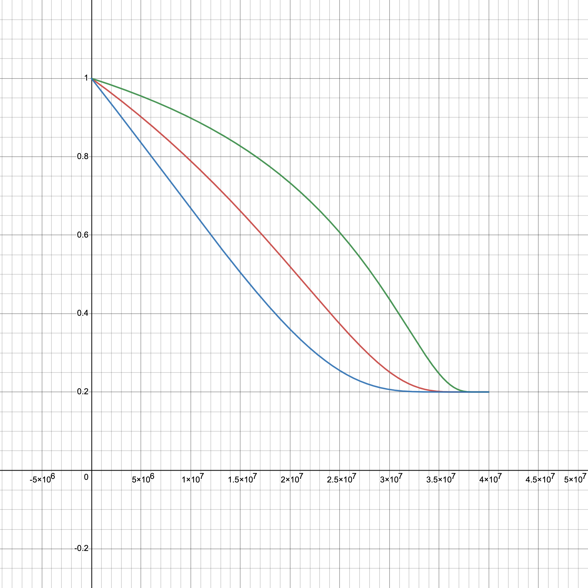

# PIT | Vote to Earn

## **Mechanism Introduction**

"Vote to Earn" is a mechanism designed to incentivize users' participation in the governance of a platform by rewarding them with PIT tokens for their voting activities. Here is a detailed explanation of this process:

1. **Governance Rewards**
   * **Voting Reward:** Users receive PIT rewards for participating in governance votes or similar activities within the community.
   * **Voting Cost:** The initial number of votes a user can cast is denoted by $$L$$, and casting these votes consumes $$\frac{1}{2}L(L+1)$$ PIC tokens. All PIC for voting will be burned.
   * **Staked PIT:** The total amount of PIT tokens a user has staked is denoted by $$N'$$.
   * **Effective Votes:** The actual number of votes a user has is given by $$M=L(N'+1)^{r_7}$$, where $$0<r_7<1$$ is a parameter. Initially, all users start with $$N'=0$$, which means their actual number of votes is $$L$$.
   * **Vote Allocation:** Users can allocate their $$M$$ votes across different options.
   * **Total and Staked PIT:** Users have a total of $$N$$ PIT tokens, with $$N'$$ of those being staked.
   *   **Growth Coefficient for PIT Rewards:** The PIT growth coefficient $$v(N,N')$$ is: is

       $$
       v(N,N')=\begin{cases}{N'}^r & N \leq c\\{\big(\frac{cN'}{N}\big)}^r & N > c\end{cases}
       $$

       where $$c >1,0<r<1$$.
   *   **Reward for Voting:** Whenever users successfully vote, they earn PIT rewards. The more votes cast, the more PIT earned.&#x20;

       The PIT amount earned per vote is

       $$
       k_{6}\bigg[\lambda+(1-\lambda)a_6^{-\frac{x}{y}}\bigg]M^{r_7}\max\{v_0,v(N,N')\}
       $$

       with constants $$k_{6}>1$$, $$a_6>1$$, $$0<r_7<1$$ and $$v_0<1$$. Here, $$y$$ represents the remaining PIT in the pool, with the initial total being  $$x+y=40,000,000$$.
   *   **Reward Based on Vote Outcome:** Additional PIT rewards are given based on the number of votes the user's chosen options receive. The formula for this is

       $$
       k_{7}\bigg[\lambda+(1-\lambda)a_7^{-\frac{x}{y}}\bigg]M_i(\frac{O_i}{\sum{O_i}})^{r_{8}}\max\{v_0,v(N,N')\}
       $$

       where $$0<r_8<1$$ is a constant, $$M_i$$ is the number of votes a user casts for a particular option, and $$O_i$$ is the total number of votes that option receives.
   *   **Early Voting Incentive:** The earlier a user votes, the more additional PIT they earn. This is calculated with

       $$
       k_{8}\bigg[\lambda+(1-\lambda)a_8^{-\frac{x}{y}}\bigg]M_i^{r_{9}}b_3^{T-t}\max\{v_0,v(N,N')\}
       $$

       where $$t$$ is the time of the vote and $$T$$ is the total time for voting.&#x20;
   * **Transaction Fee:** A 5% fee is deducted from the final PIT reward earned from voting activities.
2. **Recommendation Rewards**
   * **Total Supply**: 40,000,000 PIT tokens, which is 4% of the total.
   * **Voting Reward:** Users receive PIT rewards for participating in recommendation for works within the community, which will affect the ranking of the works in the recommendation display.
   * **Voting Cost:** Users spend $$l$$ PIC tokens in a single work for voting. All these PIC will be burned.
   * **Staked PIT:** The total amount of PIT tokens a user has staked is denoted by $$N'$$.
   * **Effective Votes:** The actual number of votes a user has is given by $$m=l^{0.5}(N'+1)^{r_7}$$, where $$0<r_7<1$$ is a parameter. Initially, all users start with $$N'=0$$, which means their actual number of votes is $$l^{0.5}$$.
   * **Total and Staked PIT:** Users have a total of $$N$$ PIT tokens, with $$N'$$ of those being staked.
   *   **Growth Coefficient for PIT Rewards:** The PIT growth coefficient $$v(N,N')$$ is: is

       $$
       v(N,N')=\begin{cases}{N'}^r & N \leq c\\{\big(\frac{cN'}{N}\big)}^r & N > c\end{cases}
       $$

       where $$c >1,0<r<1$$.
   * **Voting Period:** $$t$$ is the time of the vote and $$T$$ is the total for auction/crowdfunding/secondary transaction period.
   *   **Reward Based on Vote Outcome:** PIT rewards for every voting behavior from this single work are given based on the number of votes the user's recommendation receives and the timing of the votes. The formula for this is

       $$
       k_{7}\bigg[\lambda+(1-\lambda)a_7^{-\frac{x}{y}}\bigg]m(\frac{o_i}{\sum{o_i}})^{r_{8}}b_3^{T-t}\max\{v_0,v(N,N')\}
       $$

       where $$0<r_8<1$$ is a constant, and $$o_i$$ is the total number of votes that recommendation receives for the $$i$$th work. Here, $$y$$ represents the remaining PIT in the pool, with the initial total being $$x+y=40,000,000$$.
   * **PIT Reward Distribution Schedule**: PIT rewards are distributed after the conclusion of the event associated with the work:
     * For auction works: PIT rewards are given after the auction period ends.
     * For crowdfunding works: PIT rewards are distributed after the crowdfunding period ends.
     * For secondary market works: PIT rewards are given when the work is transacted to another user.

## Explanation and analysis

This mechanism is designed to encourage active and early participation in governance and voting, with the reward structure promoting both immediate engagement (through voting rewards) and long-term commitment (via staking). Here's a more detailed breakdown of the components and processes involved.

### Key Components

1. **Initial Setup and Voting Cost:** To cast votes, users consume PIC tokens. The cost is proportional to the square of the number of base votes $$L$$, which creates a cost barrier to prevent spam voting and to ensure that users vote thoughtfully.
2. **Effective Votes and Staking**
   * **Staked PIT (**$$N'$$**) Impact:** The number of effective votes a user has is amplified by the amount of PIT they have staked $$N'$$. This incentivizes users to stake more PIT tokens to increase their voting power, aligning user interests with the platform's long-term success.
   * **Effective Votes for Governance Calculation:** The calculation of effective votes $$M=L(N'+1)^{r_7}$$ suggests that each additional staked PIT increases voting power, but the effect diminishes as $$r_7$$ is between 0 and 1. This helps to maintain some balance and prevent large stakeholders from having an overwhelming influence.
   * **Effective Votes for Recommendation Calculation:** The number of effective votes $$m$$ is a function of the square root of PIC tokens spent $$l$$, which suggests a diminishing return on votes as more PIC tokens are spent, encouraging wider participation rather than dominance by a few wealthy users.
3. **Growth Coefficient (**$$v(N,N')$$**):** The piecewise function in this formula ensures that when the PIT held by users is less than a certain threshold (determined by $$c$$), they can directly influence the number of PIT they obtain through the amount of PIT staked. When a user's holdings exceed this threshold, the exchange efficiency is reduced as the growth coefficient is inversely proportional to the holdings $$N$$.

<figure><figcaption>
Different trend when N'=20, c=30(Red) N'=40, c=10(Blue) N'=10, c=100(Green)
</figcaption></figure>

6.  **Rewards for Voting**

    * **Reward for Successful Voting:** The formula $$k_{6}\bigg[\lambda+(1-\lambda)a_6^{-\frac{x}{y}}\bigg]M^{r_7}\max\{v_0,v(N,N')\}$$ suggests that the reward decreases as the available PIT in the NFT pool $$y$$ decreases, making early voting more lucrative. This creates urgency and encourages users to participate in governance decisions promptly.
    * **Outcome-Based Rewards:** Users receive more rewards if the options they voted for are popular, with $$k_{7}\bigg[\lambda+(1-\lambda)a_7^{-\frac{x}{y}}\bigg]M_i(\frac{O_i}{\sum{O_i}})^{r_{8}}\max\{v_0,v(N,N')\}$$. This encourages users to not only participate but also to consider the community consensus when voting.
    * The part $$a_6^{-\frac{x}{y}}$$ and $$a_7^{-\frac{x}{y}}$$ in the formula indicate that as the remaining amount of PIT decreases, i.e., $$y$$ becomes smaller, the rewards will fall. As $$x$$ grows or $$y$$ shrinks, this will serve as a regulatory mechanism to prevent overinflation of the pool's value and ensure the scarcity and value of the PIT tokens.
    * The parameter $$\lambda=0.2$$ ensures that even if the remaining amount of the token pool $$y$$ is very small, the output speed will not drop to 0, which prevents the production from coming to a complete halt.
    * The term $$1-\lambda$$ ensures that at the beginning, when $$x=0$$, the output factor is 1, which means that the token's production speed is at its maximum initially.

    <figure><figcaption>
Different trend when a_6,a_7,a_8=1.5(Green) a_6,a_7,a_8=2.5(Red) a_6,a_7,a_8=5(Blue)
</figcaption></figure>
7. **Voting Period Tracking**
   * Tracking the voting period $$t$$ and applying a decay factor $$b_3^{T-t}$$ reduces the reward potential as time progresses.
   * This incentivizes users to participate early in the voting process since votes cast earlier in the period carry more weight in the reward calculation.
   * The time-decay factor mitigates last-minute voting rushes and encourages a more continuous participation throughout the event period.

### Strategies and Incentives

"Vote to Earn" mechanism is geared towards fostering a proactive and engaged community that is invested in the platform's governance. It balances the need for active participation with the risk of centralization of power among large stakeholders, and it incentivizes early and thoughtful voting. Here are the strategies for Pido users.

1. **Incentivizing Early Voting:** Rewards decrease as the available PIT in the reward pool diminishes, which encourages users to vote early. This strategy ensures that users are attentive to governance matters and contribute to decisions before a rush at the deadline, which could influence the quality of decisions.
2. **Staking for Voting Power:** The effective votes a user can cast are influenced by the amount of PIT they stake. Users are incentivized to stake more tokens to increase their influence, which also implies a longer-term commitment to the platform.
3. **Outcome-Based Rewards:** Users are incentivized to consider the community consensus when voting, as additional rewards are based on the number of votes that the chosen options receive. This encourages users to engage in discussions and pay attention to the community's sentiment.
4. **Cost of Voting:** The initial cost in PIC tokens to cast votes creates a barrier that ensures that users vote thoughtfully. It encourages a strategic approach where users must weigh the potential rewards against the costs of participating.
5. **Transaction Fee:** The 5% transaction fee on rewards encourages users to be more strategic with their votes since there is a cost associated with the reward. It discourages frivolous or non-strategic voting.

### Long-term Participation Incentives

The mechanism is designed not just for short-term engagement but also to retain users over the long term.

1. **Decay in Reward Value:** The reward formula includes a decay factor where rewards are higher when there's more PIT in the reward pool. As the pool decreases, so do the rewards, which could encourage users to participate consistently rather than waiting for any specific time when rewards might be higher.
2. **Staking Rewards:** By tying the number of effective votes to staked PIT, the system encourages users to lock in their tokens to increase their voting power and rewards. This staking creates a vested interest in the platform's success over time.
3. **Compounded Involvement:** As users stake more PIT and engage in voting, they become more invested in the platform's outcomes. This creates a feedback loop where engaged users are rewarded, which in turn motivates them to remain active and involved.
4. **Reputation Building:** Over time, active and strategic voters may build a reputation within the community, which could have intangible benefits, including influence or recognition, beyond the direct PIT rewards.
